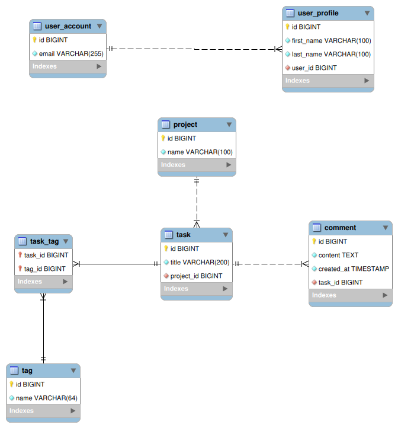

# relations-demo

A small Spring Boot project which is used to show the most common JPA-relations in action as displayed in the EER-diagram below.

[](docs/eer-diagram.png)

---

## Tech-Stack
- Java 21, Spring Boot 3.5.x (Web, Validation, Data JPA)
- MySQL 8.x
- springdoc OpenAPI (Swagger UI)
- Docker & docker-compose

---

## Quickstart (Docker)

Requirements: Docker Desktop / Running Docker Engine

### Setup your configuration
To make a quickstart, just rename the .env.demo file to .env.

(Optional) Configure the values to your liking.
```bash
cp .env.demo .env
```

### Build & Start
```bash
docker compose up -d --build
```

---

## Endpoints

| Description      | Endpoint         |
|------------------|------------------|
| **Swagger UI**   | /swagger-ui.html |
| **OpenAPI JSON** | /v3/api-docs     |
